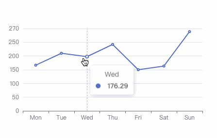

# Echarts Continuous Drag 连续拖动工具


> 用于Echarts连续拖动功能插件，该插件依靠配置tooltip.trigger下的'axis'来做处理
 

 
插件使用链式写法
```javascript
import drag from 'drag';

// use echarts do somethiong

// 需要带echarts的配置与初始化后的echarts
drag.setOption(option).drag(myChart);
```


## License

[MIT](https://github.com/Doooyf/echarts-continuous-drag/blob/master/LICENSE)

Copyright (c) 2021-present JiangYongFu
